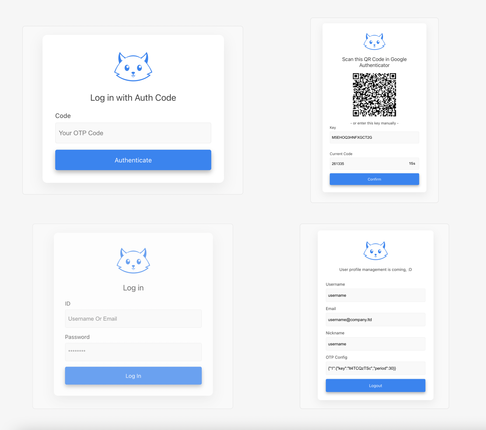

# Docker SSO Server

Self-Hosted SSO Service, Simplify login authentication operations and support OTP login.

This program can also be used as the backend of traefik forward auth.

[中文文档](./README-zhCN.md) | [CHANGELOG](./CHANGELOG.md)

## Snapshots

As a simple and lightweight program, it only has four GUIs: Login, OTP Login, OTP Binding, Account Page



## Docker

Try to run a private service in a few seconds:

```bash
docker run -d --name=sso-server \
            -e CLIENT_NAME="YOUR OWN SSO SERVER" \
            -e CLIENT_ID="YOUR_OAUTH_CLIENT_ID" \
            -e CLIENT_SECRET="YOUR_OAUTH_CLIENT_SECRET" \
            -e USER_PASS="password" \
            -p 3000:80 soulteary/sso-server:1.1.0
```

Open `http://localhost:3000/login`, you will see the login screen.

For user login, default username is `useranme` (without quotes), the password is set by `USER_PASS` variable, the password in the example is `password`.


Note: Read the configuration section below or refer to the sample file to learn how to set up your authorization license file. The `username` and `user_email` will be initialized according to the authorization license file by default.


## API && Router

There are two routes that users need to pay attention to:

- Router
  - Login Page: `/login`
  - Logout Page: `/logout`

There are two more routes you may need to know, but they are not important:

- Router
  - Health Check: `/health`
  - Account Page: `/account`

Currently the program supports five commonly used APIs:

- API
  1. User Logout: `/logout`
  2. OAuth Token: `/oauth/token`
  3. OAuth User Info: `/api/userinfo`,
  4. OAuth Client Info: `/api/clientinfo`,
  5. Traefik Forward Auth: `/api/traefik-auth-user`
  6. Outline User Auth (TBD): `Function is ready, wait for scheme stability`

Under normal circumstances, you don’t need to know how to use them, you just need to fill in them in the system you need to authenticate, like this:

```ini
tokenURL           = 'http://host-name-or-ip/oauth/token'
authorizationURL   = 'http://host-name-or-ip/dialog/authorize'
profileUrl         = 'http://host-name-or-ip/api/userinfo'
```

## Fingerprint

In order to ensure the safety of the program, when the program is started, a unique check value will be output.

**If the value does not match the list below, please do not continue to run the program.**

- Version: **soulteary/sso-server:1.0.0**
  - Fingerprint: `060d0706d05dabd66bbc94b858b48176079287862e8111f46ee08a00e80a130d`

## Login mode support

- OAuth2
- OTP
- (TBD) L2TP

## Resource usage

- CPU USAGE: <1%
- MEM USAGE: ~15MiB

## Config (`.env` file)

In order to ensure that the program can run correctly, we need to define some variables, Most configurations are optional.(Can be ignored)

| Environment variable | Optional | Example | Default | Note |
| --- | --- | --- | --- | --- |
| **USER_PASS** | NO | `YOUR_PASS_WORD` | `password` | The account password. |
| **CLIENT_ID** | NO | `YOUR_CLIENT_ID` | `SjVN7VhgOsku` | Client ID used for OAuth2 authorization |
| **CLIENT_SECRET** | NO | `YOUR_CLIENT_SECRET` | `t3Qt89nv9u5O` | Client Secret used for OAuth2 authorization |
| CLIENT_ISTRUSTED | YES | `true` | `false` | If it is true, the user information can be used without the user's explicit authorization. |
| CLIENT_NAME | YES | `My CLIENT NAME` | `GENERAL SSO SERVER` | Only used for page or command line information display. If not set, will try to use the `SERVER_NAME` variable. |
| SERVER_NAME | Yes | `My SSO Server` | `SSO Server` | Only used for page or command line information display |
| PORT | Yes | `8080` | `80` | Program listening port in the docker |
| OTP_OPTION | Yes | `KEY:m9sEH4JP6C;PERIOD:30` | empty | The OTP parameters specified by the user can be obtained on the user page after the first binding |
| SESSION_SECRET | Yes | `iWoupoFYZ9Ud` | `RANDOM STRING()` | Only used for page or command line information display |
| SERVER_DOMAIN | Yes | `sso.example.com` | empty | Only required in Traefik docker-compose.yml file |
| LICENSE | Yes | `...(huge text)` | `PRESET_LICENSE_TEXT` | The content of the user license agreement, and `LICENSE_FILE` can choose one to use |
| LICENSE_FILE | Yes | `/app/my.lic` | empty | The file path of the user license agreement file, and `LICENSE` can choose one to use |

## Example

The docker example can be viewed [here](./example).

The default account:

- username: `username`
- password: `password`

OTP verification will need to be reset as the service restarts, which further improves the security of the program.

## Option: Outbound Restriction

This project does not need to use an external network. If you are not worried about this program, you can refer to the following method to restrict the program from accessing external network data.

https://github.com/francoisruty/fruty_docker-outbound-restriction
